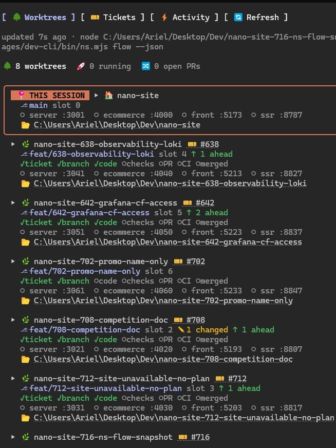

<div align="center">

# 🌳 nanoflow

**Never lose yourself in ten worktrees.**

<sub>by <a href="https://nanosite.ai"><b>nanosite.ai</b></a></sub>

Run many tasks at once with Claude Code, each in its own git worktree on its own ports, and see all of
them at a glance: which ticket, which branch, which PR, whether CI is red, what's running, what's ready to
tear down.

[Install](#-install) · [What you get](#-what-you-get) · [The CLI](#-the-cli-fewer-tokens-fewer-mistakes) · [Config](docs/config.md) · [CLI reference](docs/cli.md)

</div>

---

## The problem

Coding agents made parallel work cheap. You start a session per task, each in its own worktree, and an
hour later you have six of them. Then you're lost:

- Which terminal is working on which ticket? Which worktree is on port 5193?
- Is the PR for #712 open? Did its CI go red while you were in another session?
- Which worktrees are merged and just sitting there holding 1 GB of `node_modules` and a port?
- The agent spends half its turns re-deriving the same `gh` / `git` / `curl` rituals, and gets them wrong.

nanoflow keeps **ticket → worktree → branch → ports → PR → CI → teardown connected**, shows it live inside
Claude Code, and turns every ritual into one deterministic command.

## ✨ What you get

### A live dashboard pane

`/nanoflow` opens a pane next to your session:

<p align="center"></p>

- **Your session's worktree is framed and badged**, so you always know where *this* agent is.
- **Everything is a link**: the ticket, the PR, the failing CI run, each running service, the worktree folder.
- **Select a worktree for actions**: ▶ Start dev, ■ Stop, 🌐 Open app, 🔀 Open PR, 📋 Copy path, and
  🧹 Teardown (offered once its PR is merged, and it asks first).
- **Tickets tab**: your board's Ready / In progress / In review columns. ▶ Start a ticket (the agent runs
  the kickoff), jump to the worktree already on it, or create a new one.
- **Activity tab**: the last 50 moments, linked.

### A status line that tracks the task

```
#712 Sites go offline… │ ✓ticket ✓branch ✓code ✓checks ✓PR #713 ✗CI ○merged │ 8 worktrees · 2 running │ ⏳ tests
```

### Toasts on every moment that matters

Worktree created or removed · a service came up (with its URL) or went down · PR opened, merged or
closed · CI turned green or red · ticket closed · tests, typecheck, lint, e2e passed or failed · **a red
test turned green** (your bug repro now passes) · a skill loaded · the Playwright browser opened, saved a
screenshot, closed · and after a merge: *"Tear down app-712-site-offline? Close the browser and delete your
screenshots too."*

### Dev skills

Bundled with the plugin, written for agents, and they use the CLI:

| Skill | What it makes the agent do |
|---|---|
| `worktree-lifecycle` | ticket first → worktree → work → PR → CI → merged → teardown **with your approval** |
| `fix-bug` | reproduce with a failing test at the lowest layer, name the root cause, fix, watch it pass |
| `pr-screenshots` | verify visual changes in a real browser (Playwright MCP), attach before/after to the PR |
| `wrap-up-summary` | end every task with one scannable status footer |

## 🚀 Install

**1. The Claude Code plugin** (dashboard, status line, toasts, skills):

```
/plugin install nanoflow --marketplace nanosite-ai/nanoflow
```

**2. The CLI** (optional but recommended; the pane works without it, from plain `git` + `gh`):

```bash
npm install -g @nanosite/nanoflow     # gives you `nanoflow` and the short `nf`
```

**3. In your repo:**

```bash
nf init --board <org>/<project-number> --team   # writes .claude/nanoflow.json; --team offers the plugin to teammates
nf doctor                                       # checks git, gh auth, config, board
```

Edit the `services` in `.claude/nanoflow.json` (ports and start commands), commit `.claude/`, and you're done.
With `--team`, everyone who trusts the repo in Claude Code is offered the plugin automatically.

> **Requirements:** git, the [GitHub CLI](https://cli.github.com) (`gh auth login`; add `-s project` for
> boards), Node ≥ 20.12 for the CLI. The dashboard, status line and toasts use Claude Code **mods**
> (function-hook plugins), which are rolling out; on a build without them, the CLI and the skills still
> work on their own.

## 🔌 Ports per worktree, one shared database

Each worktree gets a **slot**. The main checkout is slot 0; every service's port is `base + slot × step`:

| Service | Slot 0 (main) | Slot 1 | Slot 2 | Slot N |
|---|---|---|---|---|
| web | 5173 | 5183 | 5193 | 5173 + 10N |
| api | 3001 | 3011 | 3021 | 3001 + 10N |

`nf wt create` (or `nf task start`) picks the next free slot, copies your gitignored files (`.env`…) from
the main checkout so **secrets and the database are shared**, writes the slot's ports into them, and
records the slot. `nf up` exports the slot's env (`PORT`, `VITE_PORT`, `API_URL`… whatever you map) and
waits until each service answers. So two branches run side by side on one machine against the same data.

**Need a branch with its own database** (say, a divergent migration)? Map it in that worktree's copied
`.env`, e.g. `DATABASE_URL=…/app_712`. Or for every worktree: `"env": { "worktree": { "QUEUE_PREFIX":
"jobs-{feature}" } }` keeps shared queues apart. Per-worktree databases are on the roadmap.

## ⚡ The CLI: fewer tokens, fewer mistakes

An agent doing a ritual by hand runs five to fifteen tool calls: look the issue up, find the board item
id in a 1,000-item JSON dump, set the column, create the worktree, copy and patch the `.env` files, pick a
free port, install, rename the session, comment on the issue. Each call costs tokens twice (the command
and its output), and each is a chance to get it wrong.

`nf task start 712` is **one call with a six-line answer**.

This comes from our own monorepo, where nanoflow started as an in-house CLI. Before it existed, in two weeks
of agent sessions we counted:

- **226** hand-rolled board edits, **39** of them failed (missing `jq`, wrong owner, empty id);
- **167** `curl` polling loops waiting for a dev server to come up;
- session titles skipped so often that nobody could tell the terminals apart.

`nf board set`, `nf up --bg` (waits until the app answers) and `nf task start` replaced them: written once,
tested, the same every time.

| Why it helps an agent | How |
|---|---|
| **Small outputs** | `nf check` prints one line per check and only the tail of a failure. `nf ci --watch --failed-log` waits without a poll loop and returns only the failing steps. `nf pr comments` returns unresolved threads, one line each. |
| **One call, not ten** | `task start`, `pr create` (push + valid title + `Closes #N` + screenshots + board + title), `wt remove` (stop processes, delete, prune, branch). |
| **Never blocks** | No prompts without a TTY. A command that needs a yes fails fast and names `--yes`. |
| **Parseable** | `--json` on every command; progress goes to stderr. |
| **Safe** | `--dry` on everything that writes. `wt remove` refuses uncommitted or unpushed work. Teardown and anything destructive need an explicit yes. |
| **Cross-platform** | Windows, macOS, Linux; npm/pnpm/yarn shims and Windows file locks handled. |
| **Cheap on GitHub** | `nf flow` reads every worktree's ticket, PR, CI and the board in **one GraphQL query**. |

### The commands

| Ritual | Command |
|---|---|
| Start a task (issue → In progress → worktree → title → comment) | `nf task start <issue#>` · `nf task start --new "<title>"` |
| A ticket for later | `nf ticket new "<title>" --type bug --definition "…"` |
| Board columns | `nf board list [ready]` · `nf board set <issue#> in-review` |
| Worktrees | `nf wt create` · `nf wt list` · `nf wt remove <name> --delete-branch` · `nf wt clean` |
| This slot's ports and env | `nf env` |
| Run the app on the slot, wait until it answers | `nf up --bg` · `nf status` · `nf logs <svc>` · `nf kill` |
| The repo's checks, condensed | `nf check [typecheck test …]` |
| Open the PR | `nf pr create --body-file pr.md --shots before.png after.png` |
| Screenshots onto a PR | `nf shots <pr#> <files…> --attach` |
| CI | `nf ci --watch --failed-log` · `nf ci --rerun-failed` |
| Review comments | `nf pr comments` · `--reply <id> --body "…"` |
| PR merged | `nf task done` |
| Everything at once | `nf flow` (`--json` is the dashboard's feed) |
| The wrap-up footer | `nf summary --what "…" --next "…"` |

Full reference: [docs/cli.md](docs/cli.md).

## 🧪 Tests, e2e and screenshots

- `nf check` runs whatever you map (`"checks": { "typecheck": "…", "test": "…", "e2e": "npx playwright test" }`).
- The plugin recognises test runners (vitest, jest, pytest, go test, cargo test, `npm test`…), `tsc`,
  `eslint` and `playwright test` with no config, and toasts each pass or fail. A check that goes from red
  to green raises *"now passes"*.
- Playwright MCP sessions are tracked: opening, screenshots, closing. At teardown you're reminded to close
  the browser and delete local screenshots.
- `--shots` puts screenshots on one orphan branch (`assets/pr-screenshots/pr-<n>-<slug>/`) and embeds them
  in the PR body. They render inline (private repos too) and never enter the merge diff.

## 🧩 Works with

| | |
|---|---|
| **Languages / frameworks** | Any. Services are just a port + a start command. |
| **Package managers** | npm, pnpm, yarn, bun (detected by `nf init`). |
| **Tickets** | GitHub Issues + GitHub Projects (v2) boards: titles, columns, PRs, CI. Jira/Linear: links via `ticket.urlTemplate`. |
| **OS** | Windows, macOS, Linux. |
| **Your own CLI** | Already have a dev CLI? Make it print the [provider contract](docs/provider-contract.md) and the dashboard uses it instead. |

## ⚙️ Configuration

One committed file, `.claude/nanoflow.json`, read by both the plugin and the CLI. Everything is optional.

```jsonc
{
  "$schema": "https://raw.githubusercontent.com/nanosite-ai/nanoflow/main/nanoflow.schema.json",
  "github": { "board": { "owner": "acme", "number": 3 } },
  "services": [
    { "name": "web", "base": 5173, "step": 10, "open": true, "start": { "run": "npm run dev", "cwd": "apps/web" } },
    { "name": "api", "base": 3001, "step": 10, "path": "/healthz", "start": { "run": "npm start", "cwd": "apps/api" } }
  ],
  "env": {
    "export": { "VITE_PORT": "{port:web}", "API_URL": "{origin:api}" },
    "files": { "apps/api/.env": { "PORT": "{port:api}" } }
  },
  "worktree": { "copy": [".env", "apps/api/.env"], "install": "npm install" },
  "checks": { "typecheck": "npm run typecheck", "lint": "npm run lint", "test": "npm test" },
  "provider": { "snapshot": ["nanoflow", "flow", "--json"], "local": ["nanoflow", "flow", "--json", "--local"] }
}
```

Every field, the placeholders and the pane's action buttons: **[docs/config.md](docs/config.md)**.

## 🗺️ Roadmap

- Per-worktree databases (create / drop with the worktree).
- Linear and Jira ticket titles and status.
- Agent-session awareness: which Claude Code session is in which worktree, across terminals.

## 🤝 Contributing

Issues and PRs welcome. Layout: the plugin is the repo root (`hooks/`, `types/`, `skills/`), the CLI is
`cli/`. Run `claude plugin validate . && claude plugin test .` for the plugin and `npm test` in `cli/`.
New CLI commands need `--help` examples, `--json` output and `--dry` before side effects.

## Made by nanosite.ai

nanoflow is built and used daily by [nanosite.ai](https://nanosite.ai). It grew out of the CLI and rituals
we use to run many agent sessions in parallel on our own monorepo, and we open-sourced it so you don't have
to rebuild it. Questions, ideas, war stories: [open an issue](https://github.com/nanosite-ai/nanoflow/issues).

## License

MIT © [nanosite.ai](https://nanosite.ai)
